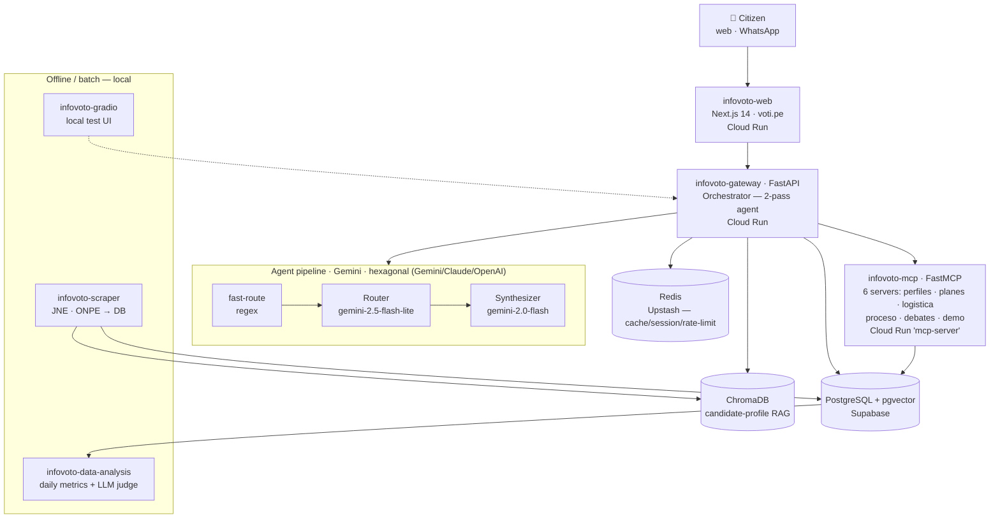
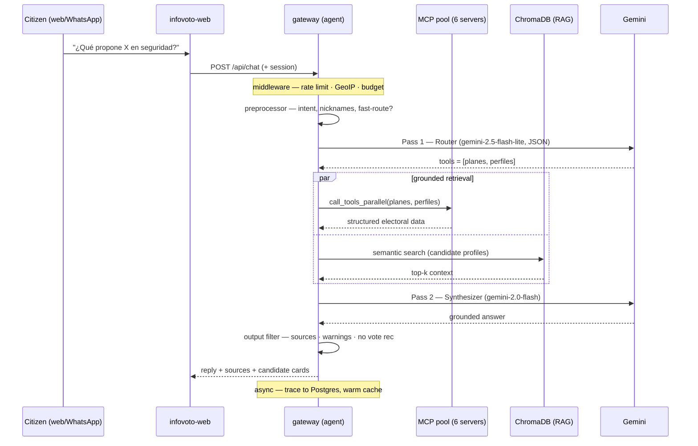

# InfoVoto Perú 2026 — "Voti" 🦙🗳️

<p align="center">
  <a href="https://voti.pe">
    
  </a>
</p>

<h2 align="center">
  <a href="https://voti.pe">→ voti.pe ←</a>
</h2>

<p align="center">
  <em>Live on Google Cloud Run · Grounded in official JNE & ONPE data · No signup required</em>
</p>

<p align="center">
  <a href="https://voti.pe"></a>
</p>

<p align="center">
  <a href="https://voti.pe"></a>
  <a href="#license"></a>
  
  
  
</p>

> The **documentation hub** — the single face — of InfoVoto Perú 2026 (product name **"Voti"**), an engineering & research portfolio by **Cristian Lazo Quispe** ([@CristianLazoQuispe](https://github.com/CristianLazoQuispe), org **iDeepBrain**). It links the ten repositories that make up the system and explains how they fit together.

---

## The Problem That Started Everything

**Thousands of candidates. Dozens of government plans. Weeks to decide.**

In a Peruvian general election, the facts that *should* decide a vote — a candidate's sworn assets, their judicial record, what their government plan actually proposes — sit scattered across JNE sworn declarations, ONPE logistics, and 33 government-plan PDFs almost nobody reads.

Into that vacuum floods misinformation: WhatsApp forwards, clips stripped of context, invented quotes. And the citizens with the least time and the least access are exactly the ones it reaches first.

**Voti exists to make the official record answerable — in plain language, with its sources attached.**

---

## Rosa's Question

Nine at night in Arequipa. Rosa is deciding between two candidates she barely knows beyond a dozen forwarded videos. One of them, a message claims, "was convicted of corruption." Is it true?

She opens WhatsApp — not to forward, but to ask.

> ### *"¿Es verdad que [candidato] tiene una condena?"*

Voti answers in seconds. Not with an opinion. With what the **JNE sworn declaration** says, what is **on record** versus what is **only alleged in the press**, and a clear note on which is which.

**No one told Rosa how to vote. Someone finally made the facts reachable.**

---

## What Voti Is

A citizen electoral assistant — built on **Gemini**, a latency-budgeted **two-pass agent**, and **Model Context Protocol** tools over official data.

### Three pillars make Voti different

1. **Grounded & source-traceable.** Every answer is built only from data returned by tools and RAG — and it carries where each fact came from (*sworn JNE declaration* vs. *external press*), with disclaimers when data is self-declared. Missing data is stated as missing, never invented.

2. **It never tells you how to vote.** A dedicated output filter neutralizes any "you should vote for…" phrasing and gates grave accusations behind judicial fact. Responsible AI is a guardrail here, not a slogan.

3. **It meets citizens where they are.** Reachable through **WhatsApp** and the **web**, in plain language — designed for the voter who has a phone and a question, not a research afternoon.

---

## The Bet

Misinformation wins when the truth is hard to reach.

**Voti makes the official record answerable in one sentence — and refuses to cross the line into telling you what to think.**

> ### *Voti. For the voter who just wants the facts.*

---

## Architecture

A citizen's question flows **web → gateway → the right MCP tools + RAG**, and returns grounded and source-cited. The gateway is a single FastAPI orchestrator running a **latency-budgeted two-pass agent** (a cheap router picks tools, a separate synthesizer writes the answer) over a **resilient MCP connection pool**. The same services run locally under Docker Compose and in production as scale-to-zero Cloud Run services.



- **LLM layer** — a hexagonal `LLMPort` with interchangeable **Gemini / Claude / OpenAI** adapters, selected by env var. Production ran **Gemini** (router `gemini-2.5-flash-lite`, synthesizer `gemini-2.0-flash`) on the free tier. No LangChain-style layer between the agent and the provider.
- **MCP layer** — `infovoto-mcp` packages **six FastMCP servers in one deployable image** (perfiles · planes · logistica · proceso · debates · demo), flag-gated. The gateway **auto-discovers** them from each server's `/metadata` — adding an MCP server needs zero gateway code changes.
- **Managed cloud** — Cloud Run with **scale-to-zero** (`min-instances=0`); Postgres + pgvector on Supabase, Redis on Upstash; binary assets (GeoLite2, ChromaDB index, sprites) in GCS.

> Rendered copy: [`assets/architecture.svg`](assets/architecture.svg) · [`.png`](assets/architecture.png). Fifteen more per-topic diagrams (data pipeline, 3-layer cache, 7-layer security, CI/CD…) live in [`assets/diagrams/`](assets/diagrams/).

---

## The System — 10 Repositories

Voti is not a monolith. It is a small fleet of focused services, each its own repository.

| Repository | What it is |
|---|---|
| [`infovoto-docs`](https://github.com/iDeepBrain/infovoto-docs) | Documentation & architecture hub (**this repo**): master diagram, per-topic diagrams, deep-research corpus, user guides. |
| [`infovoto-gateway`](https://github.com/iDeepBrain/infovoto-gateway) | The orchestrator: FastAPI + latency-budgeted **two-pass agent** (fast-route → router → synthesizer), MCP registry & resilient pool, RAG, Google OAuth. |
| [`infovoto-mcp`](https://github.com/iDeepBrain/infovoto-mcp) | **Six FastMCP servers in one service** — one electoral domain each (perfiles · planes · logistica · proceso · debates · demo), auto-discoverable. |
| [`infovoto-web`](https://github.com/iDeepBrain/infovoto-web) | Frontend & live demo ([voti.pe](https://voti.pe)): Next.js 14, streaming chat, NextAuth, a bespoke pixel-art assistant ("Voti"). |
| [`infovoto-scraper`](https://github.com/iDeepBrain/infovoto-scraper) | Civic-data ingestion: Playwright API interception of JNE (~7,100 candidate CVs), ONPE logistics, OCR of government-plan PDFs → Postgres + vector stores. |
| [`infovoto-data-analysis`](https://github.com/iDeepBrain/infovoto-data-analysis) | Continuous-improvement loop: daily analytics + **LLM-as-judge** evaluation (tone, safety, neutrality). |
| [`infovoto-infra`](https://github.com/iDeepBrain/infovoto-infra) | Docker Compose + central Makefile + GCP ops scripts + the re-activation runbook. |
| [`infovoto-gradio`](https://github.com/iDeepBrain/infovoto-gradio) | Lightweight local harness to red-team and demo the agent without WhatsApp. |
| [`infovoto-planning`](https://github.com/iDeepBrain/infovoto-planning) | Cross-repo roadmap / epic hub with a phased go-live plan. |
| [`infovoto-agent`](https://github.com/iDeepBrain/infovoto-agent) | *Legacy* — the original standalone agent, since **merged into `infovoto-gateway/src/agent/`**. |

---

## Why it's interesting

These are the engineering decisions that separate Voti from a generic chat wrapper.

- **The agent is two passes, not one.** A cheap **router** (`gemini-2.5-flash-lite`, JSON mode) decides *which* electoral tools to call; a separate **synthesizer** (`gemini-2.0-flash`) writes the answer. A regex **fast-route** short-circuits the router entirely on unambiguous questions (~1s saved). Cost and latency track the difficulty of the question.
- **Latency is a budget, not a set of fixed timeouts.** Each stage gets `min(cap, remaining − reserve)` under a hard `asyncio.wait_for` ceiling. Time saved by the fast-route is reinvested into retries or extra tool rounds — the user never waits indefinitely.
- **MCP servers are auto-discovered, and the pool is resilient.** The gateway reads each server's `/metadata` at startup (zero-code onboarding of a new server) and calls tools through a persistent, circuit-broken connection pool with background health checks.
- **Six MCP servers ship as one image.** Flag-gated FastMCP sub-apps mean the same container exposes one to six electoral domains with no code change — the "N MCPs in one service" pattern.
- **Grounding is enforced, not hoped for.** The synthesizer prompt forbids inventing data; a response validator and a non-blocking **output filter** attach sources, emit structured warnings, and strip any voting recommendation or unsupported accusation.
- **The provider is swappable behind a hexagonal port.** Gemini / Claude / OpenAI adapters implement one `LLMPort` interface, chosen by env var — full visibility, no abstraction maze to debug under load.
- **The agent improves on a feedback loop.** `infovoto-data-analysis` runs a daily **LLM-as-judge** over real traces (tone, safety, neutrality), closing the loop between production behavior and prompt/architecture changes.

---

## How a single question flows



---

## Screenshots

<table>
  <tr>
    <td width="50%" valign="top">
      <br>
      <sub><strong>Landing</strong> — voti.pe, the pixel-art assistant "Voti".</sub>
    </td>
    <td width="50%" valign="top">
      <br>
      <sub><strong>Chat</strong> — bilingual, source-cited answers (shown here in archived demo mode).</sub>
    </td>
  </tr>
</table>

---

## 📚 Technical documentation

- [`docs/technical/`](docs/technical/) — security, eval pipeline, env vars, scraper architecture
- [`docs/deepresearch/`](docs/deepresearch/) — architecture research, tiered designs, figures
- [`docs/entendimiento/`](docs/entendimiento/) — how Peruvian elections work
- [`docs/user/`](docs/user/) — end-user query guides (candidates, plans, logistics)
- [`assets/diagrams/`](assets/diagrams/) — 15 per-topic architecture diagrams (`.mmd` / `.png` / `.svg`)
- [`infovoto-infra/docs/RECREATE.md`](https://github.com/iDeepBrain/infovoto-infra/blob/main/docs/RECREATE.md) — rebuild / re-activate runbook

---

## 🚀 Quick start

### Try it live (no install)

> **🗳️ https://voti.pe** — open the landing and chat with Voti. No signup required.
> *Between elections the interactive backend is archived to keep hosting cost near zero, so the chat runs in a labeled demo mode; all credentials live in Secret Manager and the stack re-activates in minutes.*

### Or run it locally

```bash
git clone git@github.com:iDeepBrain/infovoto-infra.git
cd infovoto-infra
cp ../.env.config.example ../.env.config     # local URLs / ports
make up        # gateway + web + mcp + postgres + redis
make health
```

- Web: `http://localhost:2300` · Gateway: `http://localhost:2080` · MCP: `http://localhost:2900`

---

## Status

**Dormant between elections, reactivable for the next.** The landing stays live at [voti.pe](https://voti.pe); the backend (gateway + MCP + databases) is archived at scale-to-zero. Full source is public; recreation is documented end-to-end in [`RECREATE.md`](https://github.com/iDeepBrain/infovoto-infra/blob/main/docs/RECREATE.md).

## <a name="license"></a>License

Released under the **MIT License**. © 2026 Cristian Lazo Quispe.

---

<p align="center">
  <em>For the voter who just wants the facts.</em>
</p>

<p align="center">
  <a href="https://voti.pe">🗳️ Live demo</a> ·
  <a href="https://github.com/iDeepBrain/infovoto-gateway">🧠 Gateway</a> ·
  <a href="https://github.com/iDeepBrain/infovoto-mcp">🔌 MCP servers</a> ·
  <a href="https://github.com/iDeepBrain/infovoto-infra/blob/main/docs/RECREATE.md">🚀 Recreate runbook</a>
</p>

<p align="center">
  <sub>Built by <a href="https://github.com/CristianLazoQuispe">Cristian Lazo Quispe</a> · org <a href="https://github.com/iDeepBrain">iDeepBrain</a> · cite via <a href="CITATION.cff"><code>CITATION.cff</code></a>.</sub>
</p>
