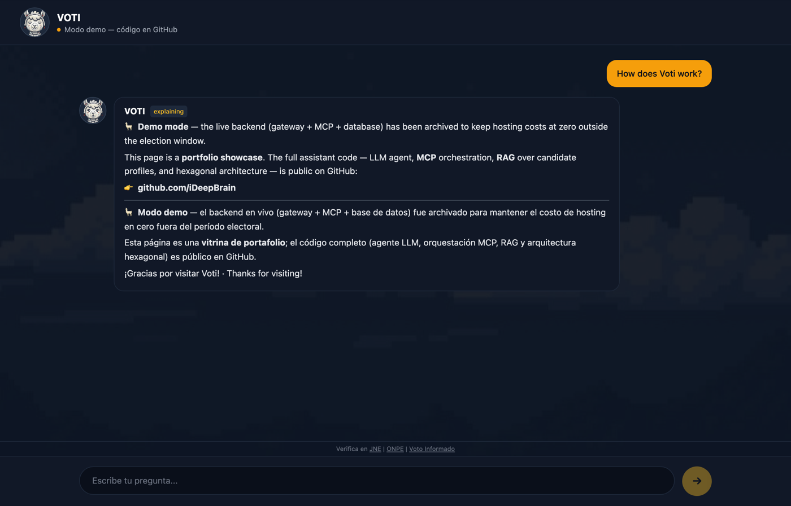
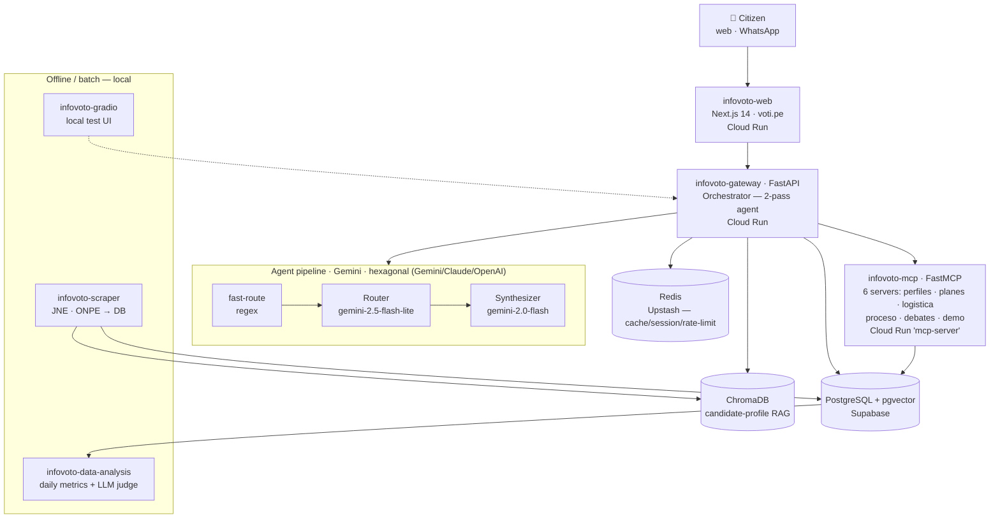

# InfoVoto Perú 2026 — "Voti" 🦙🗳️

**An open, non-partisan AI assistant that helps Peruvian citizens vote informed — grounded in official electoral data, never a voting recommendation.**

> This repository is the **documentation hub** — the single face — of the InfoVoto Perú 2026 system, an engineering & research portfolio by **Cristian Lazo Quispe** ([@CristianLazoQuispe](https://github.com/CristianLazoQuispe), org **iDeepBrain**). It links the ten repositories that make up the system and explains how they fit together.

---

## What is Voti

Peru's electoral information is fragmented across official sources (JNE sworn declarations, ONPE logistics, government plans) and is fertile ground for misinformation. **Voti** is a citizen-facing assistant, built around **responsible AI**:

- **No fabrication** — answers only from data returned by tools/RAG; missing data is stated as missing.
- **No vote recommendations** — an output filter neutralizes any "you should vote for…" phrasing.
- **Traceable sources** — every answer cites where the data came from (e.g. *sworn JNE declaration* vs. *external press*).
- **Prompt-injection resistant** — pattern guards + optional `llm-guard` scanning.

Voti reached citizens through a **web app** (voti.pe) and **WhatsApp**, answering questions about candidates, government plans, asset/judicial records, presidential debates, and the logistics of voting itself.

## Live demo & status

🌐 **[voti.pe](https://voti.pe)** — the landing page is live as a portfolio showcase.

The project is **dormant between elections**: the interactive backend (gateway + MCP + databases) has been **archived to keep hosting cost at ~zero** outside the election window, and the chatbot runs in a clearly-labeled **demo mode**. All credentials are stored in GCP Secret Manager, so the full stack can be **re-activated for the next municipal/presidential election** in minutes. The complete source code — including the conversational agent — is public across the repositories below.

| | |
|---|---|
|  |  |
| *voti.pe landing (live)* | *chat in demo mode → points to the code* |

---

## Architecture

A citizen's question flows web → gateway (orchestrator) → the right MCP tools + RAG, and comes back grounded and source-cited. The gateway runs a **latency-budgeted two-pass agent** (a cheap router picks tools, a synthesizer writes the answer) over a **resilient MCP connection pool**.

> A rendered copy lives at [`assets/architecture.svg`](assets/architecture.svg) / [`.png`](assets/architecture.png). Fifteen additional per-topic diagrams (data pipeline, 3-layer cache, 7-layer security, CI/CD, etc.) are in [`assets/diagrams/`](assets/diagrams/).

**Key design points**
- **Two-pass agent** with a regex **fast-route** short-circuit and a dynamic **time budget** (hard latency ceiling).
- **MCP registry + resilient pool** — new MCP servers are auto-discovered from `/metadata` with zero gateway code changes; circuit breakers around Redis and MCP.
- **Hexagonal LLM port** — Gemini / Claude / OpenAI adapters are interchangeable behind one interface (production ran **Gemini**).
- **Six MCP servers in one deployable service** — flag-gated FastMCP sub-apps per electoral domain.

*Deployed on **GCP** (project `proyectosia-423918`, region `us-central1`): Cloud Run services `web`, `gateway`, `mcp-server`; Postgres on Supabase, Redis on Upstash; binary assets (GeoLite2, ChromaDB index, sprites) in GCS.*

---

## The repositories

| Repository | What it demonstrates |
|---|---|
| **[infovoto-gateway](https://github.com/iDeepBrain/infovoto-gateway)** | Latency-budgeted, multi-provider **two-pass agent** (fast-route → router → synthesizer) with circuit-breaker MCP pooling — responsible-AI orchestration that never issues a voting recommendation. |
| **[infovoto-mcp](https://github.com/iDeepBrain/infovoto-mcp)** | Reference implementation of the **"N MCP servers in one deployable service"** pattern: flag-gated FastMCP sub-apps per electoral domain (perfiles · planes · logistica · proceso · debates · demo). |
| **[infovoto-web](https://github.com/iDeepBrain/infovoto-web)** | Server-rendered **Next.js 14** civic UI with a bespoke pixel-art assistant ("Voti"), streaming chat, OAuth, and source-traceable answers — human-centered design for electoral trust. |
| **[infovoto-scraper](https://github.com/iDeepBrain/infovoto-scraper)** | Robust civic-data ingestion — Playwright API interception of JNE (~7,100 candidate CVs), ONPE logistics, OCR of government-plan PDFs — feeding Postgres + vector stores. A reproducible open-data pipeline. |
| **[infovoto-data-analysis](https://github.com/iDeepBrain/infovoto-data-analysis)** | Continuous-improvement loop: daily analytics + **LLM-as-judge** evaluation (tone, safety, neutrality) closing the feedback loop on the agent. |
| **[infovoto-infra](https://github.com/iDeepBrain/infovoto-infra)** | Single-command reproducible stack (docker-compose + central Makefile) unifying six services, plus GCP ops scripts and the re-activation runbook — infrastructure-as-code discipline. |
| **[infovoto-gradio](https://github.com/iDeepBrain/infovoto-gradio)** | Lightweight local harness to red-team and demo the agent independently of WhatsApp — a fast experimentation surface. |
| **[infovoto-planning](https://github.com/iDeepBrain/infovoto-planning)** | Cross-repo roadmap / epic hub with a phased go-live plan and per-repo work-code taxonomy — visible project-management rigor. |
| **[infovoto-docs](https://github.com/iDeepBrain/infovoto-docs)** | *This repo* — the documentation hub: master architecture, per-topic diagrams, deep-research corpus, runbooks, and user guides. |
| **[infovoto-agent](https://github.com/iDeepBrain/infovoto-agent)** | *Legacy* — the original standalone Gemini agent, since **merged into `infovoto-gateway/src/agent/`**. Kept as a record of the consolidation decision. |

---

## Tech stack

**Backend** Python 3.12 · FastAPI · SQLAlchemy async + asyncpg · Alembic · Gemini (2.5-flash-lite / 2.0-flash) · Anthropic & OpenAI adapters · FastMCP
**Frontend** Next.js 14 (App Router) · TypeScript · TailwindCSS · NextAuth (Google OAuth) · framer-motion · Recharts
**Data** PostgreSQL + pgvector (Supabase) · ChromaDB (MiniLM embeddings) · Redis (Upstash)
**Infra** Docker · Google Cloud Run · Cloud Build · GCS · Docker Compose (local)
**Quality** ruff · pytest · Vitest · Playwright · pre-commit + gitleaks

## What this project demonstrates

- **Agentic AI** — tool-calling orchestration, router/synthesizer decomposition, latency budgeting, resilience.
- **Model Context Protocol** — multi-server MCP design and a single-deploy multi-MCP pattern.
- **MLOps** — Alembic migrations, per-request tracing/analytics, an LLM-as-judge evaluation loop, CI/CD.
- **Responsible AI** — grounding, source attribution, no-vote-recommendation output filtering, prompt-injection guards.
- **Software architecture** — hexagonal ports/adapters, clean separation of domain and infrastructure, IaC.

---

## Documentation map

- [`docs/technical/`](docs/technical/) — security, eval pipeline, env vars, scraper architecture
- [`docs/deepresearch/`](docs/deepresearch/) — architecture research, tiered designs, figures
- [`docs/entendimiento/`](docs/entendimiento/) — how Peruvian elections work
- [`docs/user/`](docs/user/) — end-user query guides (candidates, plans, logistics)
- [`assets/diagrams/`](assets/diagrams/) — 15 per-topic architecture diagrams (.mmd / .png / .svg)

## License

Released under the **MIT License**. © 2026 Cristian Lazo Quispe.
