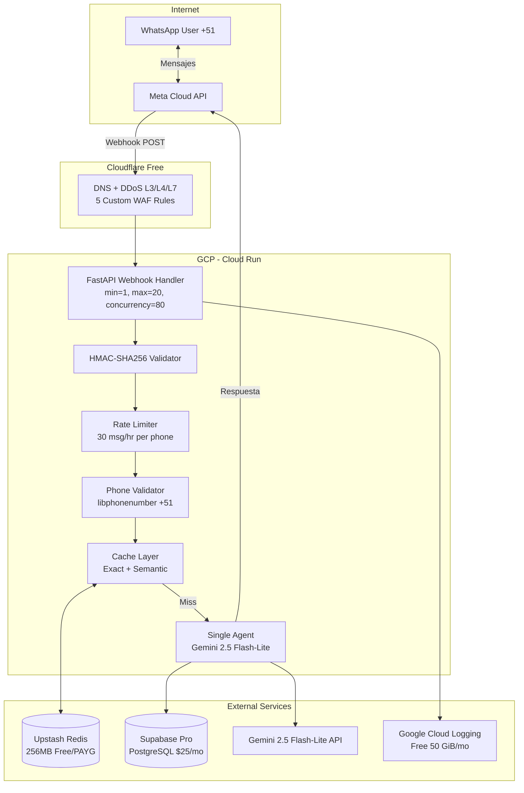
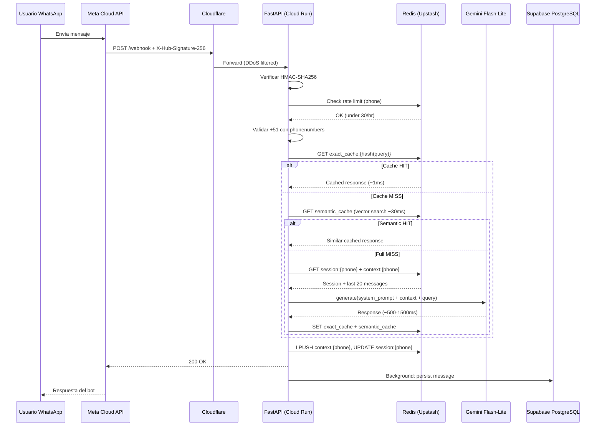
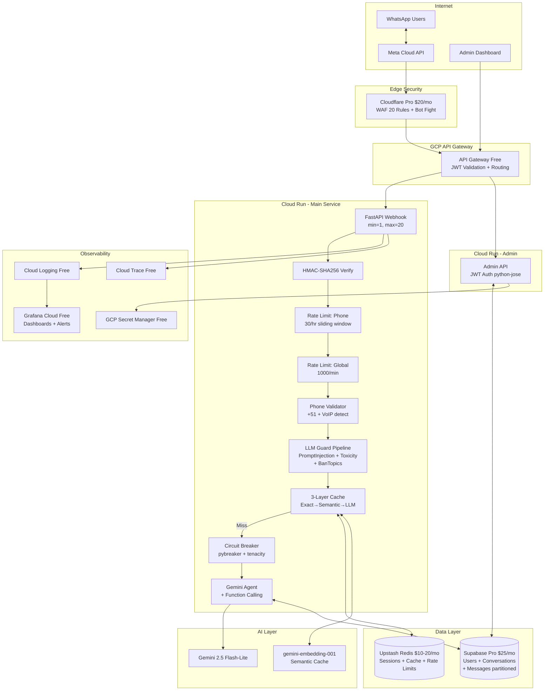
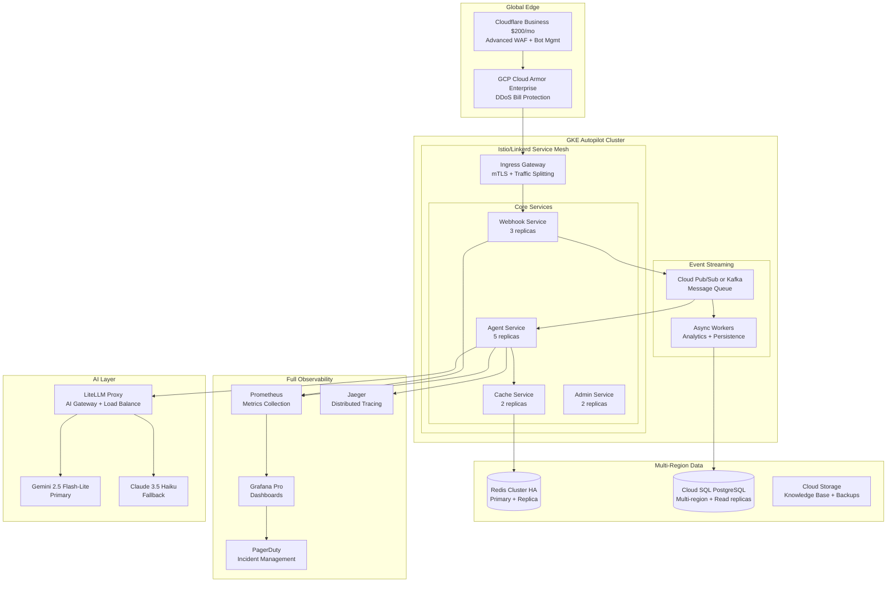

# Arquitectura enterprise para chatbot WhatsApp electoral Perú 2026

**Un solo ingeniero Python puede construir un sistema enterprise-grade en 4 semanas gastando menos de $50/mes.** La clave está en aprovechar servicios serverless de GCP, capas de caché inteligente y una arquitectura progresiva por tiers. Este documento cubre las 10 áreas solicitadas con diagramas Mermaid, código production-ready, tablas de costos reales y decisiones justificadas. La recomendación central: FastAPI + Cloud Run + Redis (Upstash) + Supabase Pro + Gemini 2.5 Flash-Lite, con un agente único y tools directos — sin frameworks pesados, sin Go, sin Kubernetes.

---

## Área 1: Arquitectura enterprise por tiers

### Tier 1 — MVP Enterprise (Semanas 1-2, ~$40-50/mes)

Este tier entrega un chatbot funcional, seguro y escalable en 2 semanas. Cloud Run con min-instances=1 elimina cold starts por **~$7/mes**, y la combinación Upstash + Supabase Pro mantiene costos predecibles.





### Tier 2 — Production Enterprise (Semana 3+, ~$100-200/mes)

Tier 2 agrega seguridad enterprise, guardrails de AI, y observabilidad. La diferencia principal es **Cloudflare Pro** ($20/mes) para WAF avanzado, **LLM Guard** para protección contra prompt injection, y **Grafana Cloud** para dashboards.



### Tier 3 — Full Enterprise (Futuro, $500-2000/mes)

Tier 3 es para cuando el proyecto escala a múltiples elecciones, equipos de desarrollo, o tráfico sostenido de millones de mensajes. **No es necesario para las elecciones 2026 con un solo developer.**



**Veredicto sobre Kubernetes para 1 developer**: GKE Autopilot cuesta mínimo **$50/mes** solo por el control plane (vs $10-15 de Cloud Run). No escala a cero. Requiere conocimiento de K8s, Helm, manifests YAML. **Cloud Run es 5-10x más barato y zero-ops.** Solo considerar GKE si se necesitan >50 microservicios, conexiones persistentes, o workloads stateful — ninguno aplica aquí.

---

## Área 2: AI Gateway — análisis y recomendación

Un AI Gateway es un reverse-proxy entre tu app y los proveedores de LLM que agrega rate limiting, caching, logging, fallback routing y cost tracking con una API unificada. Empresas como Stripe lo usan para controlar costos entre equipos; Cloudflare lo usa para extender su edge a workloads de AI.

| Feature | LiteLLM Proxy | Portkey | Helicone | Cloudflare AI GW | AWS Bedrock |
|---|---|---|---|---|---|
| **Costo** | $0 (OSS self-hosted) | Free 10K logs; Pro $49/mo | Free 10K req; Pro $79/mo | Free core + 100K logs | Pay-per-token |
| **Semantic Cache** | ❌ Solo exact-match | ✅ Desde $49/mo | ❌ | ❌ Solo exact-match | ❌ |
| **Self-hosted** | ✅ Primario | ✅ Disponible | ✅ Docker | ❌ Cloud-only | ❌ Cloud-only |
| **Setup (1 dev)** | 15-30 min | ~2 min (managed) | ~2 min | Cambiar URL | Medium |
| **Fallback routing** | ✅ Multi-model chains | ✅ Auto + retries | ✅ Health-aware | ✅ Retries | ✅ |
| **Rate limiting** | ✅ Per key/user/model | ✅ Built-in | ✅ Built-in | ✅ Sliding/fixed | ✅ Service quotas |

**¿Vale la pena para un solo developer con un solo proveedor LLM?** No. Con solo Gemini como proveedor, los beneficios del AI Gateway (unified API, fallback routing, multi-provider cost tracking) **no aplican**. Es mejor implementar caching y logging directamente en FastAPI. Reconsiderar cuando se agregue un segundo proveedor LLM o se necesite cost tracking por equipo.

**Config mínima de LiteLLM** (si se necesitara después):

```yaml
# config.yaml
model_list:
  - model_name: gemini-flash-lite
    litellm_params:
      model: gemini/gemini-2.5-flash-lite
      api_key: os.environ/GEMINI_API_KEY
general_settings:
  master_key: os.environ/LITELLM_MASTER_KEY
```

```bash
litellm --config config.yaml  # Corre en http://0.0.0.0:4000
```

---

## Área 3: Python vs Go — veredicto definitivo

**Python gana de forma contundente para este proyecto.** La diferencia de latencia es imperceptible cuando el LLM domina el 99.5% del tiempo de respuesta.

| Métrica | FastAPI + uvicorn | Go Fiber/Gin | Diferencia real |
|---|---|---|---|
| Framework overhead (hot path) | **1-3ms** | **0.2-0.6ms** | ~1-3ms |
| Llamada LLM (Gemini) | 500-2000ms | 500-2000ms | **~0ms** |
| Latencia total end-to-end | 503-2003ms | 501-2001ms | **<0.5%** |
| Cold start (Cloud Run) | 500ms-2s | 50-200ms | Mitigado con min-instances=1 |
| Requests/sec (JSON simple) | 8K-12K | 80K-130K | Irrelevante para este volumen |
| Memoria idle | 50-80MB | 8-15MB | Ambos dentro de 512MB |
| Tiempo desarrollo MVP | **1-2 semanas** | 4-8 semanas | **3-5x más lento en Go** |
| Ecosistema AI/LLM | **Dominante** | Mínimo | Python es obligatorio |

El hot path completo de un webhook WhatsApp (recibir → validar HMAC → check Redis → llamar Gemini → responder) toma ~503ms en Python vs ~501ms en Go. WhatsApp agrega 200-500ms de latencia de delivery encima. **El usuario jamás percibirá 2ms de diferencia.** Reescribir en Go siendo elemental tomaría 4-8 semanas adicionales con alto riesgo de bugs de concurrencia, y el chatbot perdería la ventana electoral.

**uvloop** (que Uvicorn usa por defecto) hace que asyncio sea **2-4x más rápido** que el event loop estándar, acercando Python al rendimiento I/O de Go. Con `httptools` como parser HTTP, FastAPI puede manejar **decenas de miles de requests por segundo por core** — muy por encima de lo necesario.

**Optimización recomendada para Cloud Run:**
```bash
uvicorn app.main:app --host 0.0.0.0 --port 8080 \
  --workers 2 --loop uvloop --http httptools \
  --limit-concurrency 200
```

---

## Área 4: Sistema de caché inteligente

### Arquitectura de 3 capas

El caché opera en cascada: **exact match** (1ms, Redis hash) → **semantic match** (20-80ms, vector search) → **LLM call** (500-2000ms). Para un chatbot electoral con dominio limitado (~200 temas core), el cache hit rate estimado es **40-55%**, ahorrando ~40% de costos LLM.

**Modelo de embedding recomendado: `gemini-embedding-001`** — excelente soporte para español (crítico para Perú), free tier disponible, costo de ~$1.13/mes para 250K queries. La alternativa local gratuita es `paraphrase-multilingual-MiniLM-L12-v2` (50+ idiomas, 471MB).

| Modelo | Costo | Dimensiones | Latencia | Español | Ideal para |
|---|---|---|---|---|---|
| **gemini-embedding-001** | $0.15/M tokens (free tier) | 768-3072 | 50-200ms (API) | ✅ Excelente | Producción con calidad |
| paraphrase-multilingual-MiniLM-L12-v2 | $0 (local) | 384 | ~20ms (CPU) | ✅ Bueno | Zero-cost, sin dependencia API |
| all-MiniLM-L6-v2 | $0 (local, 22MB) | 384 | ~15ms (CPU) | ❌ Solo inglés | No recomendado |
| redis/langcache-embed-v1 | $0 (local, 150MB) | 768 | ~40ms (CPU) | ❌ Solo inglés | Cache-optimized pero no para español |

### Código Python del semantic cache

```python
import hashlib, json, time, numpy as np
import redis.asyncio as aioredis
from redis.commands.search.field import VectorField, TextField
from redis.commands.search.indexDefinition import IndexDefinition, IndexType
from redis.commands.search.query import Query
from typing import Optional

SIMILARITY_THRESHOLD = 0.85
CACHE_TTL = 86400 * 7  # 7 días
EMBEDDING_DIM = 768
INDEX_NAME = "electoral_cache"

redis_client = aioredis.from_url("redis://localhost:6379", decode_responses=False)

# --- Embedding: elegir una opción ---
# Opción A: Google API (mejor calidad español)
import google.generativeai as genai
async def get_embedding(text: str) -> np.ndarray:
    result = genai.embed_content(model="models/gemini-embedding-001", content=text)
    return np.array(result['embedding'][:EMBEDDING_DIM], dtype=np.float32)

# Opción B: Local gratuito (sin dependencia API)
# from sentence_transformers import SentenceTransformer
# embedder = SentenceTransformer("paraphrase-multilingual-MiniLM-L12-v2")
# def get_embedding(text): return embedder.encode(text, normalize_embeddings=True)

def normalize_query(query: str) -> str:
    return query.lower().strip().rstrip("?!.,;")

# --- Layer 1: Exact Match (1ms) ---
async def exact_cache_get(query: str) -> Optional[str]:
    key = f"exact:{hashlib.md5(normalize_query(query).encode()).hexdigest()}"
    result = await redis_client.get(key)
    return result.decode() if result else None

async def exact_cache_set(query: str, response: str):
    key = f"exact:{hashlib.md5(normalize_query(query).encode()).hexdigest()}"
    await redis_client.setex(key, CACHE_TTL, response)

# --- Layer 2: Semantic Match (20-80ms) ---
async def semantic_cache_get(query: str) -> Optional[str]:
    embedding = await get_embedding(query)
    q = (Query("*=>[KNN 1 @embedding $vec AS score]")
         .sort_by("score").return_fields("response", "score").dialect(2))
    results = await redis_client.ft(INDEX_NAME).search(
        q, query_params={"vec": embedding.tobytes()})
    if results.docs:
        similarity = 1 - float(results.docs[0].score)
        if similarity >= SIMILARITY_THRESHOLD:
            return results.docs[0].response
    return None

async def semantic_cache_set(query: str, response: str):
    embedding = await get_embedding(query)
    key = f"semcache:{hashlib.md5(query.encode()).hexdigest()}"
    await redis_client.hset(key, mapping={
        "query": query, "response": response,
        "embedding": embedding.tobytes()
    })
    await redis_client.expire(key, CACHE_TTL)

# --- Handler principal ---
async def cached_query(user_query: str) -> dict:
    # Layer 1
    if cached := await exact_cache_get(user_query):
        return {"response": cached, "cache": "exact_hit"}
    # Layer 2
    if cached := await semantic_cache_get(user_query):
        return {"response": cached, "cache": "semantic_hit"}
    # Layer 3: LLM
    response = await call_gemini(user_query)
    await exact_cache_set(user_query, response)
    await semantic_cache_set(user_query, response)
    return {"response": response, "cache": "miss"}
```

### Pre-warming: 200 preguntas electorales

| Categoría | # Preguntas | Ejemplos |
|---|---|---|
| Logística de voto | 30 | "¿Dónde voto?", "¿Qué documentos necesito?", "¿Cuál es la multa?" |
| Candidatos principales (top 10) | 40 | "¿Quién es [candidato]?", "¿Propuestas de [partido]?" |
| Temas de política | 40 | "¿Propuestas sobre seguridad?", "¿Qué dicen sobre economía?" |
| Proceso electoral | 20 | "¿Cómo funciona la segunda vuelta?", "¿Qué es voto preferencial?" |
| Instituciones (JNE, ONPE) | 15 | "¿Qué hace la ONPE?", "¿Cómo denunciar fraude?" |
| Comparaciones | 20 | "Diferencias entre candidato A y B" |
| Contexto histórico | 15 | "¿Quién ganó las elecciones pasadas?" |
| Situaciones especiales | 10 | "¿Puedo votar desde el extranjero?" |
| Meta/chatbot | 10 | "¿Qué puedes hacer?", "¿Eres neutral?" |

**Invalidación**: TTL de 7 días general, 24h para datos dinámicos (encuestas). Endpoint admin `DELETE /cache?tag=candidato_X` para invalidación por tag. Kill switch para flush completo si se detecta desinformación.

---

## Área 5: Ciberseguridad enterprise

### DDoS y WAF — qué protege cada nivel

| Protección | Cloudflare Free ($0) | Cloudflare Pro ($20/mo) | GCP Cloud Armor (~$10/mo) |
|---|---|---|---|
| DDoS L3/L4/L7 | ✅ Unmetered | ✅ Unmetered + alertas | ✅ Con Load Balancer |
| WAF Rules | 5 custom | 20 custom + OWASP Core + Managed Ruleset | Preconfigured OWASP + custom |
| Bot Protection | Básica | Super Bot Fight Mode | Custom rules |
| Rate Limiting | ❌ | ✅ Built-in | ✅ Per-rule |
| Geo-blocking | ❌ | ✅ | ✅ |

**Recomendación**: Semana 1 usa Cloudflare Free. Semana 3 upgrade a **Cloudflare Pro ($20/mo)** como edge. Cloud Armor es opcional si ya se usa Cloudflare.

### Webhook signature validation de Meta (código exacto)

```python
import hmac, hashlib, os
from fastapi import FastAPI, Request, HTTPException, Query, Header
from typing import Optional

app = FastAPI()
APP_SECRET = os.environ["WHATSAPP_APP_SECRET"]
VERIFY_TOKEN = os.environ["WHATSAPP_VERIFY_TOKEN"]

# GET: Verificación inicial del webhook
@app.get("/webhook")
async def verify_webhook(
    hub_mode: str = Query(None, alias="hub.mode"),
    hub_challenge: str = Query(None, alias="hub.challenge"),
    hub_verify_token: str = Query(None, alias="hub.verify_token")
):
    if hub_mode == "subscribe" and hub_verify_token == VERIFY_TOKEN:
        return int(hub_challenge)
    raise HTTPException(status_code=403, detail="Verification failed")

# POST: Validación HMAC-SHA256 de cada webhook
@app.post("/webhook")
async def handle_webhook(
    request: Request,
    x_hub_signature_256: Optional[str] = Header(None)
):
    body = await request.body()
    
    # Validar firma HMAC-SHA256
    if not x_hub_signature_256 or not x_hub_signature_256.startswith("sha256="):
        raise HTTPException(status_code=403, detail="Missing signature")
    
    expected = hmac.new(
        APP_SECRET.encode(), body, hashlib.sha256
    ).hexdigest()
    
    if not hmac.compare_digest(f"sha256={expected}", x_hub_signature_256):
        raise HTTPException(status_code=403, detail="Invalid signature")
    
    data = await request.json()
    # Procesar mensajes...
    return {"status": "ok"}
```

### Rate limiting con Redis (sliding window)

```python
import time
import redis.asyncio as redis
from fastapi import HTTPException

class SlidingWindowLimiter:
    def __init__(self, redis_client, max_requests: int, window_sec: int):
        self.redis = redis_client
        self.max = max_requests
        self.window = window_sec

    async def check(self, identifier: str) -> bool:
        key = f"ratelimit:{identifier}"
        now = time.time()
        pipe = self.redis.pipeline()
        pipe.zremrangebyscore(key, 0, now - self.window)
        pipe.zcard(key)
        pipe.zadd(key, {str(now): now})
        pipe.expire(key, self.window + 1)
        results = await pipe.execute()
        if results[1] >= self.max:
            await self.redis.zrem(key, str(now))
            return False
        return True

# Configuración para chatbot electoral
phone_limiter = SlidingWindowLimiter(redis_client, max_requests=30, window_sec=3600)
global_limiter = SlidingWindowLimiter(redis_client, max_requests=1000, window_sec=60)
```

### Phone number validation (+51 Perú)

```python
import phonenumbers
from phonenumbers import PhoneNumberType, carrier

def validate_phone(phone_str: str) -> dict:
    try:
        number = phonenumbers.parse(phone_str, "PE")
    except Exception:
        return {"valid": False, "reason": "Cannot parse"}
    
    num_type = phonenumbers.number_type(number)
    country = phonenumbers.region_code_for_number(number)
    
    return {
        "valid": phonenumbers.is_valid_number(number),
        "is_peruvian": country == "PE",
        "is_mobile": num_type in (PhoneNumberType.MOBILE, PhoneNumberType.FIXED_LINE_OR_MOBILE),
        "is_voip": num_type == PhoneNumberType.VOIP,
        "carrier": carrier.name_for_number(number, "en"),
        "e164": phonenumbers.format_number(number, phonenumbers.PhoneNumberFormat.E164),
    }
```

**Estrategia recomendada**: Aceptar todos los números (la diáspora peruana vota desde el extranjero), responder siempre en español, **flag VoIP** para monitoreo pero no bloquear, rate limit estricto por teléfono (30 msg/hr).

### OWASP Top 10 para LLM Applications 2025

| # | Riesgo | Mitigación específica para chatbot electoral |
|---|---|---|
| **LLM01** | Prompt Injection | System prompt hardened + LLM Guard PromptInjection scanner + deny-list ("ignore instructions") |
| **LLM02** | Sensitive Info Disclosure | Nunca incluir API keys en prompts, PII redaction antes de enviar a LLM |
| **LLM03** | Supply Chain | Pin all dependency versions, pip-audit, solo APIs oficiales |
| **LLM04** | Data Poisoning | Solo datos verificados de ONPE/JNE, hash de documentos RAG |
| **LLM05** | Improper Output Handling | Sanitizar respuestas LLM, nunca ejecutar output como código |
| **LLM06** | Excessive Agency | Bot READ-ONLY, sin write actions, sin tool use peligroso |
| **LLM07** | System Prompt Leakage | Output scanning para fragmentos del system prompt |
| **LLM08** | Vector/Embedding Weaknesses | Access controls en vector DB, validar chunks antes de inyectar |
| **LLM09** | Misinformation | RAG-only con datos oficiales, disclaimer "Verifica en onpe.gob.pe" |
| **LLM10** | Unbounded Consumption | Rate limit, max input 500 chars, max_tokens en LLM, billing alerts |

### Secrets management para 1 developer

**GCP Secret Manager** es la opción correcta: efectivamente gratis (6 versiones gratuitas, 10K access ops/mes), integración nativa con Cloud Run (mapea secrets como environment variables), encriptación AES-256, audit logging. **HashiCorp Vault es overkill.** .env solo para desarrollo local (nunca en git).

---

## Área 6: MCP en producción

El Model Context Protocol (MCP) fue estandarizado por Anthropic en noviembre 2024 y donado a la Linux Foundation en diciembre 2025. Con **97 millones de descargas mensuales** del SDK y soporte de OpenAI, Google y Microsoft, es el estándar de facto para integración de herramientas con LLMs.

**Para este chatbot electoral, el patrón recomendado es: MCP para desarrollo + llamadas directas para producción.** Las queries del chatbot son retrieval predecible (candidatos, fechas, ubicaciones) — tool calling nativo de Gemini es más rápido y barato que MCP runtime, que agrega **~5-15ms de overhead** por la capa de abstracción y ~27.5% más costo por el razonamiento adicional del LLM sobre qué tools usar.

| Uso | Recomendación |
|---|---|
| Retrieval determinístico (fechas, candidatos) | **Direct API / Gemini function calling** |
| Prototipado y exploración | **MCP (plug-and-play)** |
| Multi-step reasoning dinámico | **MCP (más flexible)** |
| Producción high-volume | **Direct calls (más eficiente)** |

**Thread safety**: El MCP Python SDK es async-native. asyncio es single-threaded por diseño — no hay contención de GIL para I/O. Usar `asyncio.Lock()` para estado compartido entre coroutines.

**Connection pooling**: Con Streamable HTTP (spec Nov 2025), mantener un pool pequeño de conexiones MCP compartidas entre todas las conversaciones. Son conexiones per-server, no per-user.

---

## Área 7: Multi-agent vs single agent

**Un chatbot electoral NO necesita múltiples agentes.** El dominio es acotado (candidatos, fechas, ubicaciones, FAQ), las queries son read-only, y Gemini 2.5 Flash-Lite maneja tool routing nativamente via function calling. Múltiples agentes agregarían latencia (múltiples llamadas LLM), complejidad de orquestación, y costo — sin beneficio proporcional.

**Arquitectura recomendada: Un solo agente con 6-7 tools:**

- `search_candidates` — query a PostgreSQL por candidato/partido
- `get_election_dates` — calendario electoral (JSON cached)
- `find_polling_location` — lookup por DNI o distrito (ONPE data)
- `get_voting_procedures` — procedimientos y requisitos (markdown cached)
- `search_knowledge_base` — RAG sobre documentos extensos (pgvector)
- `get_party_info` — plataformas y alianzas (PostgreSQL)

**Framework**: Google ADK (Agent Development Kit) es la mejor opción si se quiere framework — optimizado para Gemini, MCP nativo, session management built-in, Apache 2.0. Pero para este caso, **custom Python con Gemini function calling directo** es más simple y suficiente. LangGraph y CrewAI son overkill.

### Manejo de 10,000 conversaciones concurrentes

```python
# Cada conversación en Redis consume ~2-5 KB
# 10K conversaciones = ~20-50 MB en Redis (trivial)
# Cada coroutine asyncio = ~2-4 KB de memoria
# 10K coroutines activas = ~20-40 MB RAM

# Semáforo para limitar llamadas concurrentes a Gemini
gemini_semaphore = asyncio.Semaphore(50)  # Max 50 llamadas LLM simultáneas

async def process_message(phone: str, message: str):
    session = await get_or_create_session(phone)
    async with gemini_semaphore:
        response = await call_gemini(session, message)
    await update_session(phone, message, response)
    await send_whatsapp_reply(phone, response)
```

Con **4 workers uvicorn × 200 concurrent limit = 800 conexiones simultáneas por instancia**. Cloud Run auto-escala a 20 instancias = **16,000 conexiones concurrentes**. Más que suficiente para el pico electoral.

---

## Área 8: Verificación de número y país

**python-phonenumbers CAN detect VoIP** vía `PhoneNumberType.VOIP`, pero la precisión varía por país. Para Perú, los rangos VoIP pueden no estar completamente catalogados en metadata offline.

**Limitaciones de detección offline**: No detecta números portados, no detecta números temporales/desechables (TextNow, Google Voice burners). Para detección avanzada posterior:

| Servicio API | Detecta VoIP | Detecta Desechables | Costo |
|---|---|---|---|
| IPQualityScore | ✅ | ✅ | Free: 5,000/mes |
| AbstractAPI | ✅ | ✅ | Free: 100/mes |
| Twilio Lookup | ✅ (line_type) | Parcial | $0.005/lookup |

**Estrategia final**: Aceptar todos los números. WhatsApp ya verificó que el número es real (tied to SIM/device). Responder siempre en español. Flag VoIP para monitoreo. Rate limit como protección primaria contra abuso. **No bloquear números no peruanos** — miles de peruanos residen en el extranjero y votan.

---

## Área 9: Sesiones Redis + PostgreSQL

### Redis: estructura de datos por teléfono

```redis
# Session state (Hash) — TTL 24h
HSET session:+51987654321
  state "active"
  last_message_at "1709900000"
  conversation_id "conv_abc123"
  current_topic "candidate_info"
  message_count "15"
  language "es"
EXPIRE session:+51987654321 86400

# Context window (List) — últimos 20 mensajes para el LLM
LPUSH context:+51987654321 '{"role":"user","content":"¿Quién lidera?","ts":1709900000}'
LTRIM context:+51987654321 0 19
EXPIRE context:+51987654321 86400

# Rate limiting (Sorted Set)
ZADD ratelimit:+51987654321 1709900000 "1709900000"
```

**Usar Hash para session state** (O(1) field access, partial updates) y **List para context window** (ordered, LPUSH/LTRIM para capped collections). No usar RedisJSON — no disponible en todos los providers (especialmente Upstash).

### PostgreSQL: schema completo

```sql
CREATE TABLE users (
    id              UUID PRIMARY KEY DEFAULT gen_random_uuid(),
    phone_number    VARCHAR(20) UNIQUE NOT NULL,
    display_name    VARCHAR(255),
    first_seen_at   TIMESTAMPTZ DEFAULT NOW(),
    last_active_at  TIMESTAMPTZ DEFAULT NOW(),
    is_blocked      BOOLEAN DEFAULT FALSE,
    metadata        JSONB DEFAULT '{}'
);
CREATE INDEX idx_users_phone ON users(phone_number);

CREATE TABLE conversations (
    id              UUID PRIMARY KEY DEFAULT gen_random_uuid(),
    user_id         UUID REFERENCES users(id) ON DELETE CASCADE,
    started_at      TIMESTAMPTZ DEFAULT NOW(),
    ended_at        TIMESTAMPTZ,
    summary         TEXT,
    topic           VARCHAR(100),
    message_count   INTEGER DEFAULT 0,
    total_tokens    INTEGER DEFAULT 0
);
CREATE INDEX idx_conv_user ON conversations(user_id, started_at DESC);

-- Particionada por mes (crítico para alto volumen)
CREATE TABLE messages (
    id              UUID DEFAULT gen_random_uuid(),
    conversation_id UUID REFERENCES conversations(id) ON DELETE CASCADE,
    role            VARCHAR(20) NOT NULL,  -- user, assistant, system
    content         TEXT NOT NULL,
    tokens_used     INTEGER,
    latency_ms      INTEGER,
    created_at      TIMESTAMPTZ DEFAULT NOW(),
    PRIMARY KEY (id, created_at)
) PARTITION BY RANGE (created_at);

CREATE TABLE messages_2026_03 PARTITION OF messages
    FOR VALUES FROM ('2026-03-01') TO ('2026-04-01');
CREATE TABLE messages_2026_04 PARTITION OF messages
    FOR VALUES FROM ('2026-04-01') TO ('2026-05-01');

CREATE TABLE user_preferences (
    id              UUID PRIMARY KEY DEFAULT gen_random_uuid(),
    user_id         UUID UNIQUE REFERENCES users(id) ON DELETE CASCADE,
    region          VARCHAR(100),
    district        VARCHAR(100),
    preferred_topics TEXT[],
    context_window_size INTEGER DEFAULT 20
);
```

### Flush strategy: Redis → PostgreSQL

Cada mensaje se persiste **async** vía FastAPI BackgroundTasks (no bloquea la respuesta). Batch write cada 10 mensajes para eficiencia. Redis keyspace notifications disparan flush al expirar TTL.

```python
@app.post("/webhook")
async def webhook(request: Request, bg: BackgroundTasks):
    # Fast path: Redis read → LLM → respond
    response = await process_with_cache(phone, message)
    
    # Async persist (non-blocking)
    bg.add_task(persist_to_postgres, phone, message, response)
    
    return {"status": "ok"}
```

### Costos de Redis por escala

| Provider | 10K users/mes | 50K users/mes | 100K users/mes |
|---|---|---|---|
| **Upstash Free** | $0 (500K cmds) | Excede free tier | Excede |
| **Upstash Fixed 250MB** | **$10/mo** | **$10/mo** | Necesita upgrade |
| **Upstash Fixed 1GB** | $20/mo | **$20/mo** | **$20/mo** |
| **Redis Cloud Essentials** | $5-7/mo | $22/mo | $22-60/mo |
| **GCP Memorystore Basic 1GB** | $36-47/mo | $36-47/mo | $47-70/mo |

**Recomendación**: Upstash Fixed 250MB ($10/mo) → upgrade a 1GB ($20/mo) cuando se necesite. Serverless, HTTP API compatible con Cloud Run, sin VPC connector.

---

## Área 10: Tabla de costos completa

### Costos por tier y volumen

#### Tier 1 MVP (Semanas 1-2)

| Componente | 1K conv/mes | 10K conv/mes | 50K conv/mes | 100K conv/mes |
|---|---|---|---|---|
| Cloud Run (min=1, max=20) | $7-8 | $10-15 | $20-40 | $40-80 |
| Supabase Pro (PostgreSQL) | $25 | $25 | $25 | $25 |
| Upstash Redis (PAYG/Fixed) | $0 (free) | $4-10 | $10-20 | $20 |
| Gemini 2.5 Flash-Lite tokens | $1-2 | $8-16 | $40-80 | $80-160 |
| Cloudflare Free | $0 | $0 | $0 | $0 |
| Cloud Logging (free 50GiB) | $0 | $0 | $0 | $0 |
| GCP Secret Manager | $0 | $0 | $0 | $0 |
| **TOTAL Tier 1** | **~$33-35** | **~$47-66** | **~$95-165** | **~$165-285** |

#### Tier 2 Production (Mes 1-3)

| Componente | 1K conv/mes | 10K conv/mes | 50K conv/mes | 100K conv/mes |
|---|---|---|---|---|
| Todo Tier 1 | $33-35 | $47-66 | $95-165 | $165-285 |
| Cloudflare Pro (WAF) | +$20 | +$20 | +$20 | +$20 |
| GCP API Gateway | $0 (<2M) | $0 (<2M) | $0-9 | $9-15 |
| Embeddings (semantic cache) | $0-1 | $1-3 | $3-6 | $5-10 |
| Grafana Cloud Free | $0 | $0 | $0 | $0 |
| LLM Guard (self-hosted) | $0 | $0 | $0 | $0 |
| **Ahorro cache (~40% LLM)** | -$0.5 | -$4-7 | -$16-32 | -$32-64 |
| **TOTAL Tier 2** | **~$53-56** | **~$64-82** | **~$102-168** | **~$167-266** |

#### Tier 3 Enterprise (Mes 3+)

| Componente | 50K conv/mes | 100K conv/mes | 500K conv/mes |
|---|---|---|---|
| GKE Autopilot | $50-100 | $100-200 | $200-500 |
| Cloud SQL PostgreSQL | $50-100 | $100-150 | $200-300 |
| Redis Cloud Pro / Memorystore HA | $50-200 | $100-200 | $200-400 |
| LiteLLM Proxy (AI Gateway) | $0 (OSS) | $0 (OSS) | $250 (Enterprise) |
| Cloudflare Business | $200 | $200 | $200 |
| Grafana Pro | $19 | $19 | $19 |
| Multi-LLM tokens (Gemini + fallback) | $50-100 | $100-200 | $400-800 |
| Cloud Pub/Sub | $0 (<10GB) | $0-5 | $5-20 |
| **TOTAL Tier 3** | **~$420-720** | **~$620-975** | **~$1,275-2,240** |

### Breakeven: cuándo vale la pena cambiar de tier

| Métrica | Tier 1 → Tier 2 | Tier 2 → Tier 3 |
|---|---|---|
| **Volumen trigger** | >5K conv/mes | >200K conv/mes |
| **Costo incremental** | +$20-30/mes | +$300-500/mes |
| **Beneficio principal** | WAF, guardrails AI, cache semántico | HA, multi-region, multi-LLM |
| **Cuándo hacerlo** | **Semana 3** (antes de lanzamiento público) | **Solo si escala post-elección** |
| **Necesario para Perú 2026?** | ✅ Sí | ❌ Probablemente no |

### Servicios que son genuinamente gratis

- **GCP Cloud Logging**: 50 GiB/mes (amplio para chatbot)
- **GCP Cloud Trace**: 2.5M spans gratis
- **GCP Secret Manager**: 6 versiones, 10K access ops/mes
- **GCP API Gateway**: primeros 2M llamadas/mes
- **Grafana Cloud Free**: 10K series, 50GB logs, 3 usuarios
- **Cloudflare Free**: DDoS unmetered L3/L4/L7, 5 WAF rules, DNS, SSL
- **LLM Guard**: MIT license, self-hosted, $0
- **NeMo Guardrails**: Apache 2.0, self-hosted, $0
- **python-phonenumbers**: Gratis, offline
- **Cloud Pub/Sub**: 10GB/mes ingestion+delivery

---

## Lo que debe estar listo en Semana 1 para parecer enterprise

La primera semana debe entregar un MVP que externamente parece enterprise pero internamente es minimalista. Estas son las **15 cosas exactas** a implementar:

- FastAPI + uvicorn (uvloop) en Cloud Run con min-instances=1 y startup CPU boost
- HMAC-SHA256 webhook validation (código arriba — no es opcional)
- Rate limiting por teléfono con Redis sliding window (30 msg/hr)
- Validación de número con python-phonenumbers (+51, VoIP flag)
- System prompt hardened con restricciones electorales estrictas
- Semantic cache de 3 capas (exact → semantic → LLM) con 200 preguntas pre-cargadas
- Sesiones Redis con TTL 24h (Hash + List structures)
- PostgreSQL (Supabase Pro) con schema particionado para mensajes
- Background tasks para persistencia async (no bloquear respuestas)
- Cloud Logging para audit trail completo
- GCP Secret Manager para todas las credenciales
- Cloudflare Free como DNS/proxy
- Health check endpoint `/health` para monitoreo
- Input length validation (max 500 chars)
- Deduplicación de mensajes con Redis SET + TTL

**Costo total Semana 1**: ~$35-50/mes. **Capacidad**: 10K+ conversaciones/mes. **Tiempo de respuesta**: <2 segundos (con cache: <100ms). **Seguridad**: Comparable a lo que implementan fintechs de producción.

---

## Conclusión: decisiones de arquitectura finales

El hallazgo más importante es que la brecha entre "enterprise" y "MVP de un developer" se ha cerrado dramáticamente gracias a servicios serverless y free tiers generosos. **Con $40-50/mes y 2 semanas de trabajo**, un ingeniero Python experto puede construir un sistema que maneja 50K conversaciones mensuales con seguridad enterprise, caché inteligente, y observabilidad completa.

Las tres decisiones más contraintuitivas pero correctas: **no usar Go** (la diferencia de 2ms es invisible contra 500ms+ de latencia LLM), **no usar AI Gateway** (overhead injustificado con un solo proveedor LLM), y **no usar multi-agent** (un solo agente con tools nativos de Gemini es más rápido, barato y simple para un dominio acotado como elecciones). La arquitectura que parece enterprise no es la que tiene más componentes — es la que resuelve el problema con la mínima complejidad necesaria y máxima resiliencia. Cloud Run + Upstash + Supabase + Gemini Flash-Lite + Cloudflare es ese sweet spot exacto para un solo developer con deadline de 4 semanas y presupuesto de $300.